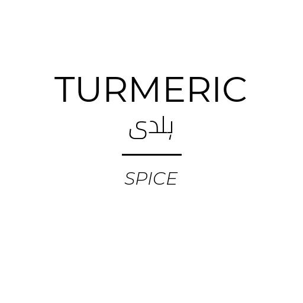

# pretty-kitchen-labels
 Generating pretty multilingual (EN/UR) spice/pantry labels using the
 Pillow library.

 The original inspiration of this project was rooted in my my parents moving
 into their new home. With the concept of the kitchen being *minimal*, I wanted
 to ditch all the manufacturer packaging and have everything in clear containers
 with a respective label.

# Examples
|||
|---	|---	|

# Usage
 1. In the `labels.json` file, define the list of entries in the following form:
```json
[
    {
        "name": "Name in English",
        "name_ur": "نام اردو میں",
        "category": "Category Name in English"
    }
]
```
2. Create an empty directory named `labels`.

3. Run ```shell python main.py```
